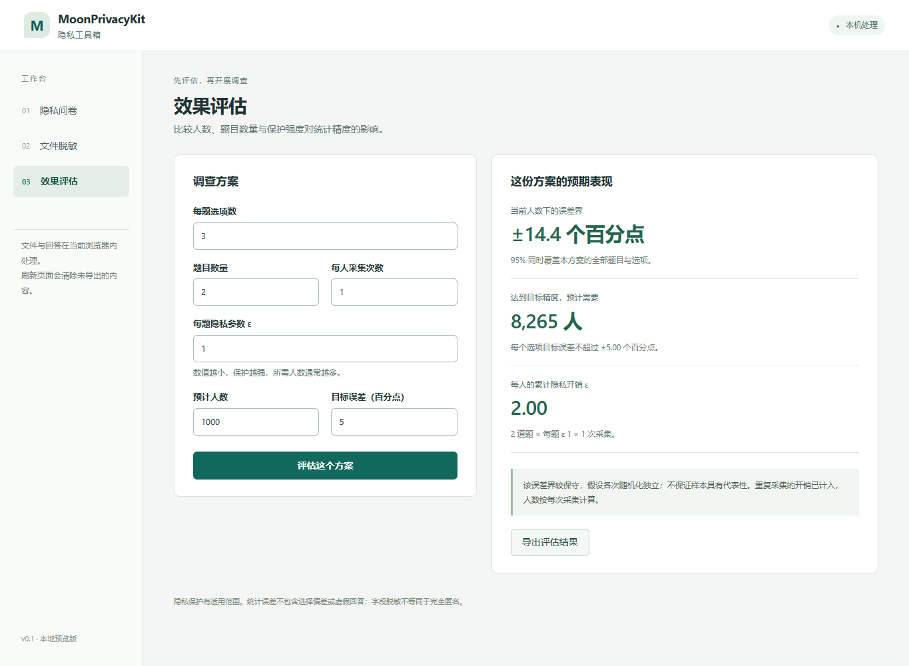

# MoonPrivacyKit · 隐私工具箱

[](https://github.com/TingxuanHan/MoonPrivacyKit/actions/workflows/ci.yml)

用 MoonBit 构建的隐私工具库与中文本地工作台，当前支持隐私问卷、真实数据字段处理与效果评估。长期持续开发更多实用工具，以一致的操作和配置方式帮助用户按需求选用、组合与切换隐私保护方案。



## 现在可以做什么

| 任务 | 首版已实现 |
| --- | --- |
| 隐私问卷 | 创建有限选项问卷、本地保护回答、导出响应文件、配置指纹校验、重复文件去重、汇总比例与误差范围 |
| 文件脱敏 | CSV／JSON 显式字段删除与遮盖、预览、导出、只含数量的处理记录、CSV 公式文本化选项 |
| 效果评估 | 比较选项数、人数、题目数量、每题 ε 与采集次数；估计误差、所需人数和累计隐私开销 |
| 中心化隐私统计核心 | 按人限制贡献的计数与预设类别直方图、整数噪声、安全随机适配、95% 同时误差界；目前通过程序接口调用 |
| 发布预算与结果复用 | 本地持久账本、精确预算累计、超预算拒绝、同一请求结果复用、并发与中断恢复；提供 Node.js 和命令行入口 |
| 开发集成 | MoonBit 类型化接口、JSON 调用接口、Web Crypto 安全随机适配器、命令行、模拟与持续集成 |

这是 **v0.1 本地原型**。首期通过文件交换收集回答；在线问卷托管、身份与网络元数据隔离、全局重复参与限制、自动敏感信息识别均未实现。

## 快速运行

准备 [MoonBit 稳定版工具链](https://www.moonbitlang.com/download) 和 Node.js 22.13.0 或以上版本，确保 `moon`、`node` 在 PATH 中。应用没有第三方 JavaScript 运行时依赖；本地账本使用 Node.js 内置 SQLite。

```sh
npm run build
npm start
```

浏览器打开 **http://127.0.0.1:4173**。Windows 也可以双击仓库内的 `start.cmd`，它会构建并打开工作台。关闭启动终端可停止服务。

处理发生在当前浏览器内，不向服务器提交问卷或数据文件；本地服务只提供固定的程序资源。页面没有第三方统计脚本，不使用浏览器持久化存储。刷新后需要重新导入，已下载的文件保存在使用者选择的位置。

## 三个完整示例

- **团队意见调查：**在“隐私问卷 → 创建问卷”载入示例并导出；参与者进入“填写问卷”载入配置、填写并下载受保护回答；组织者在“汇总结果”选择原问卷及回答文件，查看群体估计与误差。
- **处理真实数据：**在“文件脱敏”导入 CSV／JSON，选择要删除或遮盖的字段，检查预览后下载结果和处理记录。原文件不被覆盖。
- **设计调查：**在“效果评估”输入预计人数、题目数量、保护参数和目标误差，查看当前精度及建议人数，导出方案用于后续调整。

命令行对应流程见 [使用说明](docs/GETTING_STARTED.md)，可直接使用 `examples/` 中的虚构数据。

中心化统计核心的虚构数据示例为 `node examples/central.mjs`，需先构建。带预算管理的完整命令行示例见[发布账本](docs/RELEASE_LEDGER.md)，可创建预算、发布统计、查看剩余量并重复导出原结果。任意 CSV／JSON 表的统计字段映射和工作台报告入口尚未接入。

## 开发与验证

```sh
# 编译检查、Wasm 与 JavaScript 目标测试、命令行与统计测试
npm run verify

# 安装浏览器测试依赖并验证完整界面流程
npm ci --ignore-scripts
npx playwright install chromium
npm run test:ui

# 可复现的虚构数据评估；先创建 reports 目录，输出文件必须不存在
node scripts/evaluate.mjs reports/evaluation.json
```

本地验证记录及限制见 [VALIDATION.md](docs/VALIDATION.md)。GitHub Actions 在推送与拉取请求时运行核心、文件操作和浏览器测试。开发时每完成一个可验证的功能节点再提交，修复也保留独立记录。

## 实现结构

- 根目录 `.mbt`：随机响应、中心化隐私统计、比例估计、方案评估、问卷模型、CSV／JSON 脱敏与输入校验。
- `bridge/`：导出 MoonBit JSON 接口，编译成 `dist/core.js`。
- `runtime/`：安全随机数、配置指纹、发布账本与宿主适配。
- `web/`、`cli/`：中文工作台与文件操作入口。
- `tests/`、`scripts/`：端到端测试、构建、评估与本地服务。

MoonBit 核心可面向 Wasm 和 JavaScript 编译；当前工作台运行的是 **MoonBit 编译得到的 JavaScript**。尚未提供浏览器 Wasm 加载器。

## 保护范围

随机响应保护已声明选项中的回答内容，不隐藏参与事实、文件传送身份、IP 或设备信息。它依赖可信客户端与安全随机源；重复生成回答会产生额外隐私开销，重试应复用同一文件。小样本不一定能产生有用的统计结论。

脱敏由使用者明确选字段。未选中的字段和字段之间的关联仍可能泄露信息，不承诺完全匿名。详细说明见 [隐私模型](docs/PRIVACY_MODEL.md) 与 [机制及误差分析](docs/MECHANISM.md)。

中心化统计依赖可信数据持有者，以及正确、稳定的人员标识；保护统计输出，不隐藏持有者已知的明细。通过账本发布时，新请求累计消耗 ε，同一请求复用原结果。直接调用无状态核心不会自动记账；删除或回滚本地账本也不能被视为重置隐私开销。

## 路线与来源

项目长期目标是持续扩展、统一易用的隐私工具平台。后续将提供数据泛化、隐私统计报告、样本重叠核对、联合分析和加密数据委托计算等工具；通过任务向导、可复用配置及流程模板，让用户在兼容条件下衔接工具，按需求切换方案，减少重复学习与配置。

中心化差分隐私核心与发布账本已实现，下一步连接真实文件的统计配置和工作台报告流程；通用跨工具衔接、方案切换及新增密码计算工具尚未实现。具体交付内容见[开发路线](docs/ROADMAP.md)，共同使用方式和支撑技术见[工具与技术规划](docs/TECHNOLOGY_PLAN.md)，申报正文见 [APPLICATION.md](docs/APPLICATION.md)。

采用 Apache-2.0。随机响应使用公开统计方法，核心实现独立编写，不宣称发明新的隐私算法，也不把整个 MoonBit 隐私领域视为生态空白。[参考资料与相邻项目](docs/REFERENCES.md) 说明了项目范围与许可来源。
